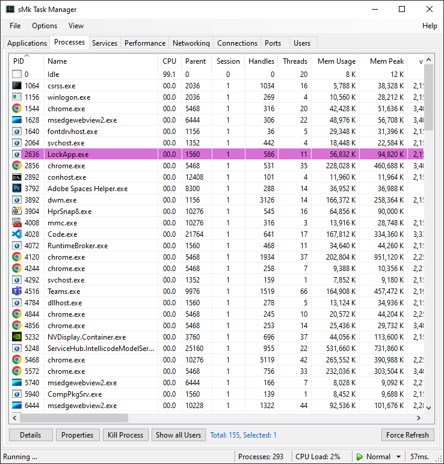
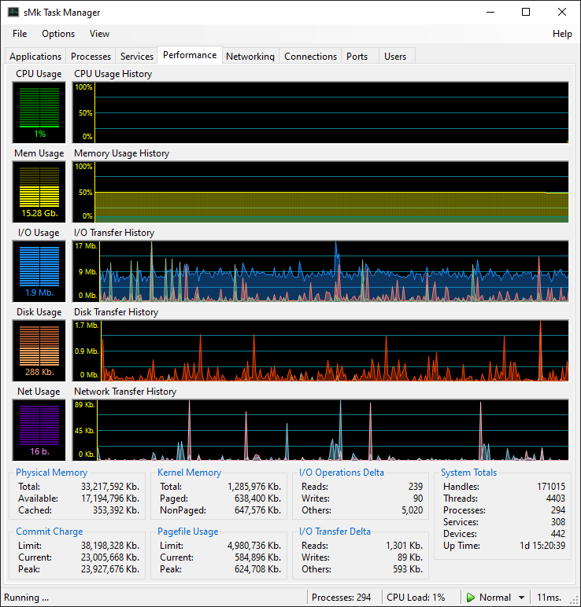
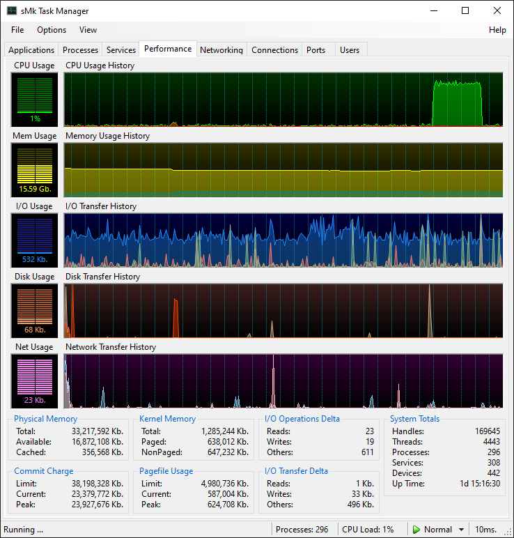
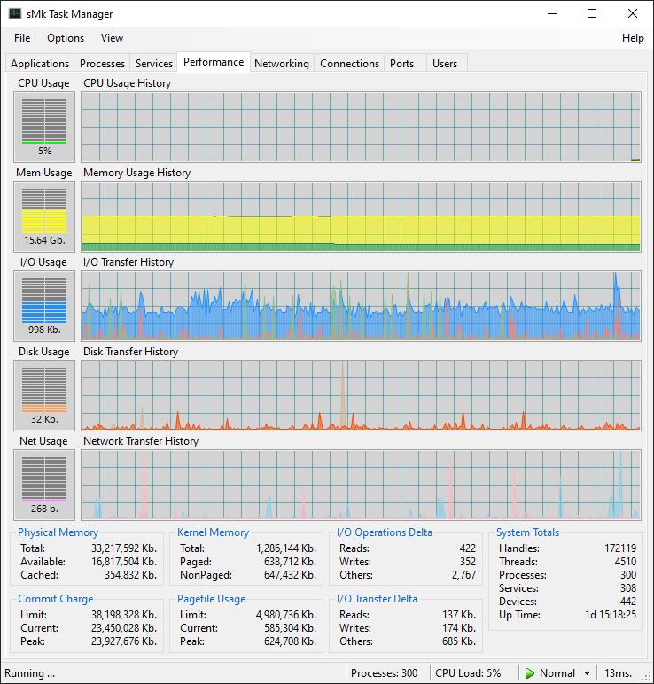
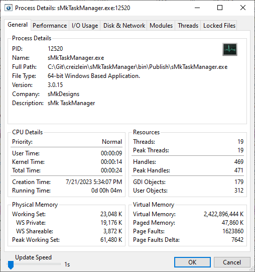
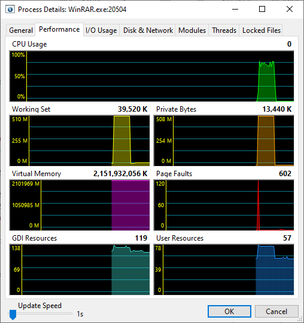
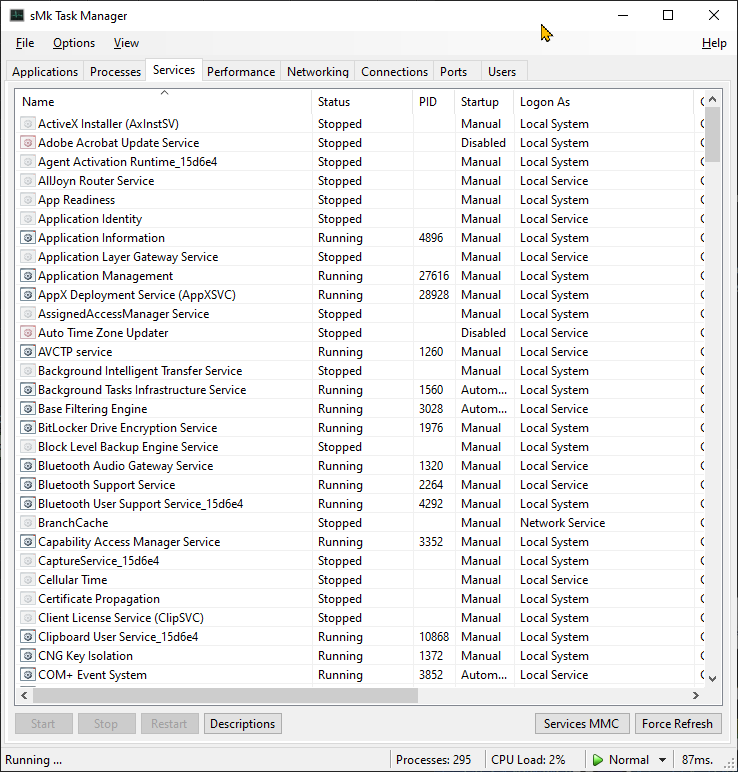
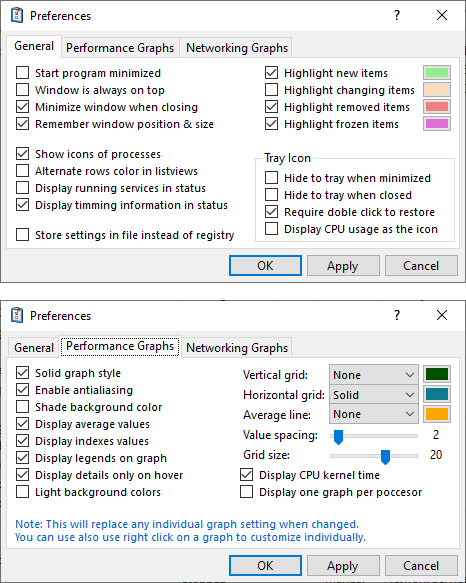

  
  
  
  
  

# sMk Task Manager

Yet another Windows Task Manager, in wannabe sMk style. With legacy WinForms!

## Repetitive Goal

So, there are probably more than a hundred of Task Managers alternatives out there, and there have been around since forever, what makes this one any different? Nothing... But I promise this one look pretty!

I have coded the initial version of this Task Manager back in 2005 with the inception of .NET Framework 2.0 in VB.net, and then ported it to .NET Framework 4.5 few years later, since then I have been using it continuously on all my machines. The goal of this project is first and foremost migrate away from VB.net and finally leap up to C# while learning in the process and update to use .NET 7.0+. However, keep in mind that I love WinForms applications and thus I retained its legacy core, there are no plans to switch to anything else for now.

## Disclaimer & Warnings

I'm in no way an experienced C# developer, in fact, I'm a proud 15+ year VB/VB.net lover.  I started playing with C# since the early .NET 2.0 stages, but never get used to it, even less proficient and efficient.  
I’m also not a professional developer nor I do programming for living (sort of).  I made this, along with any other application just for fun and for myself, I decided to share it publicly to learn more from the community.

Most likely you will see pieces of code that are UGLY for experienced programmers, even more on this segment where it involves resources, handles, P/Invokes and process handling. If so. please apologize.

## Main Features

+ A very nostalgic but extremly cool System Properties pages.
+ Detailed overview of all running processes activity with highlighting.
+ System performance metrics, CPU, Memory, I/O, Disk, Network.
+ GPU performance metrics, Engines, Memory, Power, Temperatures.
+ Network usage statistics, global and per network interface.
+ List of active connections by process and their traffic usage.
+ List of listening ports, and which processes is holding it.
+ List and control services pretty much as services.msc.
+ Hardware Device Manager, pretty much as devmgr.msc.
+ List of user and windows terminal services sessions.
+ Intuitive to legacy users (not millennials) as a legacy Task Manager.
+ Customizable graphs, column details and layouts.
+ Small, portable, fast-ish, and 100% Free to use and modify.

## Screenshot

  
  
  
  
   
  
  
  
  

## System requirements

It seems odd to talk about requirements nowadays but let’s keep it simple and basic.  
**[Windows 10 or higher - 64 Bits](https://www.microsoft.com/software-download/windows11)** - I have ditched and no longer test it on 32 Bits.  
**[.NET Desktop Runtime 7.0](https://dotnet.microsoft.com/en-us/download/dotnet/7.0)** - Currently targeting .NET Desktop 7.0.*  
On the other hand, if you really like this application and need to run on older legacy systems, I can provide you with the old version which stills runs on Windows XP onwards.

## Administrative Privileges

For the time being, this application will require and must be run with elevated privileges and administrative role. I have no short-term plans to change this behavior as most of its functionality is meant to be used by administrators anyway.

## Hidden Features

Not planning to write much documentation on usage, but encourage everyone to play around with the application and find its quirks and features, among those you can find:

+ Double click on the performance tab graphs to enlarge and switch to Full Screen Mode.
+ Hold shift or ctrl and right on any graph to access its customizable options.
+ Press F2, F3 or F4 to go directly to each Preference’s tab.
+ Drag any column on the ListView controls to re-order or click to sort.

## Missing Features

These features were originally implemented on older versions, but I removed the code because it was buggy

+ Processes CommandLine is not implemented.
+ List & Release locked files.
+ New Task (Run As).

## Future Features

+ DarkMode (someday, when WinForms properly supports it).
+ Better graphs customization and profiles.
+ WSL Instances lists and control.
+ Hyper-V Machine lists and control.
+ More detailed Disk Performance and Usage monitor.

## Special Thanks

I would like to mention that I have a deep admiration for these projects and true developers that inspired my work and from which I admit borrowed several ideas.

+ [Process Explorer](https://learn.microsoft.com/en-us/sysinternals/downloads/process-explorer) (c) Mark Russinovich
+ [Process Hacker](https://processhacker.sourceforge.io/) (c) Wen Jia Liu, now known as [System Informer](https://github.com/winsiderss/systeminformer)
+ Original Windows Task Manager (c) [Dave Plummer](https://www.youtube.com/c/DavesGarage)
+ [PCMgr](https://github.com/imengyu/PCMgr) (c) imengyu
